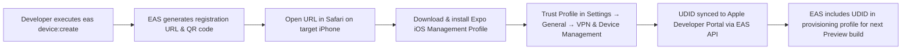
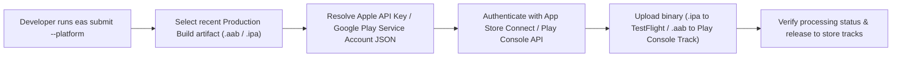
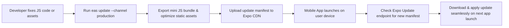
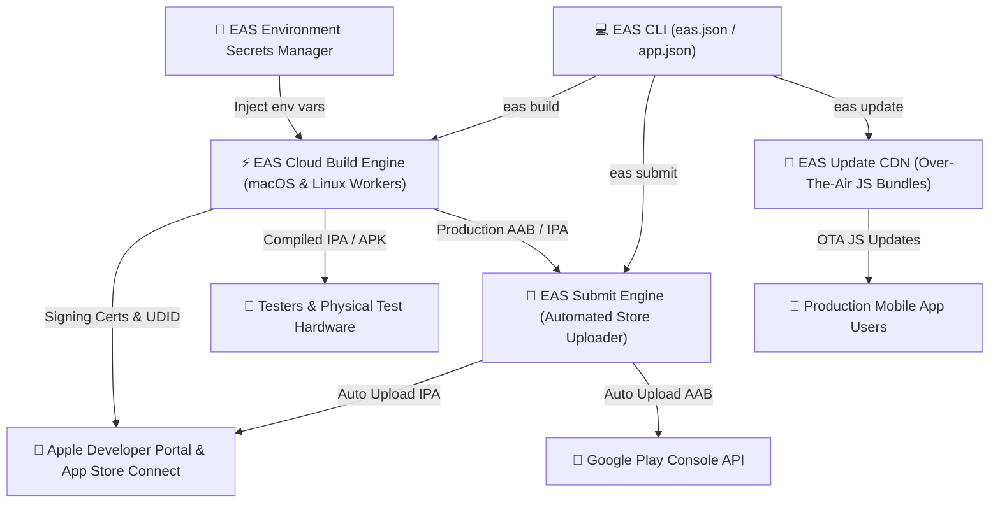

# 🚀 Building & Deploying with EAS (Expo Application Services)

**Production-grade deployment playbook for building, distributing, and submitting AI Workout Tracker to iOS and Android.**

[](https://docs.expo.dev/build/introduction/)
[](https://docs.expo.dev/submit/introduction/)
[](https://expo.dev)

---

## 📌 Table of Contents

- [⚙️ How EAS Works](#️-how-eas-works)
- [⚙️ Prerequisites \& Setup](#️-prerequisites--setup)
- [🛠 Project Configuration (`eas.json`)](#-project-configuration-easjson)
- [📲 Device Registration (iOS)](#-device-registration-ios)
- [📦 Executing Builds](#-executing-builds)
- [⚖️ Android vs iOS Compatibility Matrix](#️-android-vs-ios-compatibility-matrix)
- [🚀 App Store \& Google Play Submission](#-app-store--google-play-submission)
- [🔄 OTA Updates (EAS Update)](#-ota-updates-eas-update)
- [💡 Troubleshooting \& Best Practices](#-troubleshooting--best-practices)

---

## ⚙️ How EAS Works

### CLI Cloud Build Execution Flow

```mermaid
flowchart LR
    DevCmd["Developer runs eas build --profile --platform"] --> LocalScan["EAS CLI parses eas.json & app.json"]
    LocalScan --> UploadTar["Package source code & upload tarball to EAS Cloud"]
    UploadTar --> CloudRunner["EAS Worker spawned (Linux for Android / macOS for iOS)"]
    CloudRunner --> Credentials["Fetch signing certificates from Expo Credential Manager"]
    Credentials --> Compile["Execute prebuild, install dependencies & run native compilation"]
    Compile --> Artifacts["Generate build output (.apk / .aab / .ipa)"]
    Artifacts --> CDN["Host artifact on Expo CDN & generate download link / QR code"]
```



### iOS Physical Device Ad-Hoc Registration Flow



### Store Submission & Release Flow



### Over-The-Air (OTA) EAS Update Flow



### EAS Infrastructure Topology Overview



---

## ⚙️ Prerequisites & Setup

Before building native artifacts with EAS, ensure the following requirements are met:

- **Node.js**: `≥ 22.13.0` (Required for Expo SDK 57 compatibility).
- **Expo Account**: Free or paid account at [Expo.dev](https://expo.dev).
- **Apple Developer Account** _(Required for physical iOS builds)_: Paid account ($99/year).
- **Google Play Console Account** _(Required for Android Play Store submission)_: One-time fee ($25).

### Initial CLI Setup

1. **Install the EAS CLI globally:**

   ```bash
   npm install --global eas-cli
   ```

2. **Authenticate with your Expo account:**

   ```bash
   eas login
   ```

3. **Link your local project to Expo Cloud Services:**

   ```bash
   eas build:configure
   ```

   _This command automatically updates `app.json` with a unique `projectId` under `extra.eas` and verifies `eas.json`._

---

## 🛠 Project Configuration (`eas.json`)

The `eas.json` file defines build parameters, environment scopes, and submission parameters across `development`, `preview`, and `production` profiles.

```jsonc
// The committed eas.json — shown here with explanatory comments.
{
  "cli": {
    "version": ">= 22.0.0", // Minimum EAS CLI version enforced by Expo
    "appVersionSource": "remote", // App version & build number resolved on EAS (CI-friendly)
  },
  "build": {
    "development": {
      "developmentClient": true, // Compiles an Expo Dev Client (debugging + hot reload)
      "distribution": "internal",
    },
    "preview": {
      "distribution": "internal",
      "android": {
        "buildType": "apk", // Directly installable APK for testers
      },
    },
    "production": {
      "autoIncrement": true, // Unique store build number on every release
    },
  },
  "submit": {
    "production": {},
  },
}
```

### Profile Breakdown

> [!NOTE]
>
> - **`development`** — Compiles an internal **Expo Dev Client** (via `developmentClient: true`) with the native debugger and hot-reload support. Perfect for daily native development.
> - **`preview`** — Produces a standalone, installable build **without** debug tooling attached. The `android.buildType: "apk"` yields a directly distributable APK, ideal for QA and client demos.
> - **`production`** — Compiles optimized store-ready artifacts (`.aab` for Google Play, `.ipa` for App Store Connect) with `autoIncrement: true` so every release gets a unique build number.

### Key Fields at a Glance

| Field                                 | Meaning                                                                                                  |
| :------------------------------------ | :------------------------------------------------------------------------------------------------------- |
| `cli.version`                         | Minimum EAS CLI required to run builds — the repo pins `>= 22.0.0`.                                      |
| `cli.appVersionSource`                | With `"remote"`, EAS manages app version/build numbers centrally — best for CI-driven release pipelines. |
| `build.*.distribution`                | `internal` keeps builds private to your Expo team; use `external` only for public/beta channels.         |
| `build.development.developmentClient` | When `true`, the build includes the Dev Launcher and debugging surface.                                  |
| `build.preview.android.buildType`     | `"apk"` produces an installable APK; use `"app-bundle"` for Play Store AAB artifacts.                    |
| `build.production.autoIncrement`      | EAS automatically increments the build number on each new production build.                              |

---

## 📲 Device Registration (iOS)

> [!IMPORTANT]
> **Apple Security Policy:** Physical iPhones require explicit UDID registration before ad-hoc preview builds can be installed. (Android does not require device registration).

1. **Register a physical test device:**

   ```bash
   eas device:create
   ```

2. **Complete Registration on iPhone:**
   - Open the generated QR code/link in **Safari** on the test iPhone.
   - Install the Expo Management Profile when prompted in **Settings → General → VPN & Device Management**.
   - Your device UDID will automatically sync with your Apple Developer Account via EAS.

---

## 📦 Executing Builds

EAS compiles your native binaries on managed cloud servers (macOS for iOS, Linux for Android), eliminating the need for local Xcode or Android Studio installations.

> [!TIP]
> If a build fails due to stale caches or lingering artifacts, rerun it with `--clear-cache`:
> `eas build --profile preview --platform android --clear-cache`

### 1. Development Client Builds

Build a custom development client to test **native** modules locally:

```bash
# Android Development APK
eas build --profile development --platform android

# iOS Simulator Build
eas build --profile development --platform ios
```

### 2. Preview & Internal Testing Builds

Generate installable standalone packages for QA testers and internal devices:

```bash
# Android Standalone APK (Install directly on any device)
eas build --profile preview --platform android

# iOS Registered Device Build (Installs via Safari link)
eas build --profile preview --platform ios

# Build Preview for both platforms simultaneously
eas build --profile preview --platform all
```

### 3. Production Release Builds

Compile final store-ready release packages:

```bash
# Android Play Store Bundle (.aab)
eas build --profile production --platform android

# iOS App Store Package (.ipa)
eas build --profile production --platform ios

# Build Production for both platforms
eas build --profile production --platform all
```

---

## ⚖️ Android vs iOS Compatibility Matrix

| Aspect                         | Android                        | iOS                                              |
| :----------------------------- | :----------------------------- | :----------------------------------------------- |
| **Store Artifact Format**      | Android App Bundle (`.aab`)    | iOS App Store Package (`.ipa`)                   |
| **Preview Testing Format**     | Android Package (`.apk`)       | Registered Ad-Hoc (`.ipa`)                       |
| **Device UDID Registration**   | Not required                   | **Mandatory** (`eas device:create`)              |
| **Developer Account Required** | Only for Play Store submission | Required for physical device testing & App Store |
| **Post-Install Step**          | Allow "Unknown Apps" prompt    | Trust Developer Profile in Settings              |
| **Build Host Environment**     | Managed Linux Instance         | Managed macOS Instance (Xcode)                   |

---

## 🚀 App Store & Google Play Submission

Automate submission of compiled production binaries directly to Google Play Console and Apple App Store Connect without manual browser uploads.

### Submitting Builds

```bash
# Submit latest production Android AAB to Google Play
eas submit --platform android

# Submit latest production iOS IPA to App Store Connect / TestFlight
eas submit --platform ios
```

> [!TIP]
> **First-Time Configuration:** During initial execution, `eas submit` prompts you to link your **Google Play Service Account JSON** key or **Apple App Store Connect API key**. Keep these credentials in a secret manager / CI secret — never commit them.

### Release Checklist

Before pushing a submission to the stores:

- [ ] `npm run lint` and `npx tsc --noEmit` pass cleanly.
- [ ] Production builds succeed for both platforms (`eas build --profile production --platform all`).
- [ ] Store metadata (privacy, screenshots, data safety) is compliant with platform policies.
- [ ] Versioning is deterministic: `autoIncrement: true` + `appVersionSource: "remote"`.
- [ ] The iOS build is validated in **TestFlight** before any App Store public rollout.

---

## 🔄 OTA Updates (EAS Update)

Publish instantaneous JS bundle and asset updates over-the-air — no full App Store rebuild or review cycle needed.

- ✅ **Use for**: JS-only bugfixes, new screens, assets, and dependency-level tweaks.
- ❌ **Not for**: native code changes, new native modules, or SDK upgrades — those require a full rebuild.

```bash
# Install the EAS Update library (one time only)
npx expo install expo-updates

# One-time configuration (writes updates.url and syncs channels)
eas update:configure

# Publish an update to the preview channel (dev / QA testers)
eas update --channel preview --message "Bugfix: Workout session timer state"

# Publish an update to the production channel (all store users)
eas update --channel production --message "Release: AI workout instructions enhancement"

# Staged rollout — gradually ship to 20% of users (range 0.0 – 1.0)
eas update --channel production --percent 0.2 --message "Staged rollout: session analytics"
```

> [!NOTE]
> The `--channel` flag must match the channel baked into the app release (`app.json` → `updates.channel`). Running `eas update:configure` and rebuilding keeps them in sync automatically.

---

## 💡 Troubleshooting & Best Practices

### 🔐 Environment Secrets Management

> [!WARNING]
> **Never commit secrets.** Production API credentials, database connection strings, signing keys, and third-party tokens belong in **EAS Secrets** — never in a committed `.env` file.

```bash
# Create / update a secret (injected into every cloud build & update)
eas secret:create --name DATABASE_URL --value "postgresql://..." --type string

# List configured secrets
eas secret:list

# Delete a secret
eas secret:delete --name DATABASE_URL
```

> [!IMPORTANT]
> Variables prefixed with `EXPO_PUBLIC_*` (e.g. `EXPO_PUBLIC_API_URL`) are **inlined into the JS bundle at build time** and visible to end users — never put private keys behind a `PUBLIC_` prefix.

### Common Solutions

| Problem                          | Quick Fix                                                                                              |
| :------------------------------- | :----------------------------------------------------------------------------------------------------- |
| Build Out-of-Memory / Timeout    | Optimize assets and remove unused packages; verify parity with `npx expo install --check`.             |
| Stale-cache build failures       | Rerun with `--clear-cache` (e.g. `eas build --profile preview --platform android --clear-cache`).      |
| iOS install failure              | Confirm UDID via `eas device:list`; trust profile at **Settings → General → VPN & Device Management**. |
| Direct APK distribution          | Use the `preview` profile — `buildType: "apk"` is pre-enabled in `eas.json`.                           |
| Store rejects a duplicate binary | Keep `autoIncrement: true` with `appVersionSource: "remote"`.                                          |
| Unexpected CLI behavior          | Run `eas diagnostics` to hand Expo Support reproducible logs.                                          |

> [!TIP]
> Tag every build with `eas build --message "..."` and audit history with `eas build:list` for full traceability.
