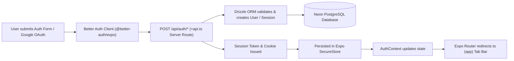
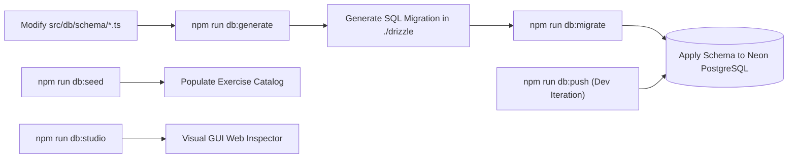
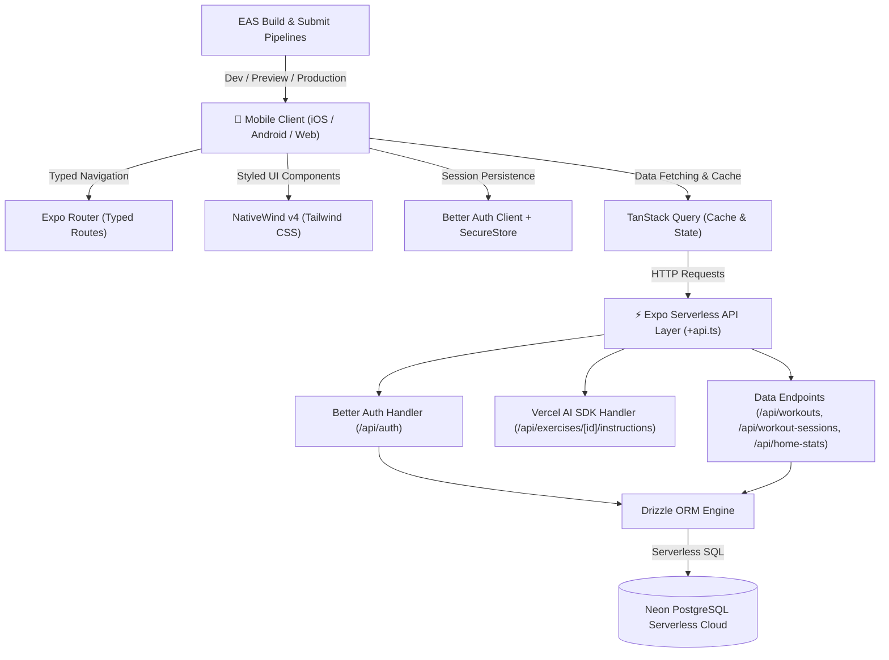

# 🏋️‍♂️ AI Workout Tracker

**Production-grade, cross-platform mobile fitness companion featuring live set logging, streak analytics, full-stack Expo Router API routes, and AI-powered exercise form instructions.**

[](https://docs.expo.dev/versions/v57.0.0/)
[](https://reactnative.dev/)
[](https://react.dev/)
[](https://www.typescriptlang.org/)
[](https://www.nativewind.dev/)
[](https://orm.drizzle.team/)
[](https://www.better-auth.com/)

**🚀 [Quick Start](#quick-start--setup)** &nbsp;·&nbsp; **🔌 [API Reference](#full-stack-api-reference)** &nbsp;·&nbsp; **⚙️ [How It Works](#how-it-works)** &nbsp;·&nbsp; **🛠️ [Tech Stack](#technology-stack)** &nbsp;·&nbsp; **💾 [Database](#database-management--migrations)** &nbsp;·&nbsp; **📱 [Deploy](#native-build--eas-deployment)**

---

## 📌 Table of Contents

- [✨ Overview \& Key Features](#overview--key-features)
- [⚙️ How It Works](#️-how-it-works)
- [🛠 Technology Stack](#technology-stack)
- [📁 Project Directory Topology](#project-directory-topology)
- [🔌 Full-Stack API Reference](#full-stack-api-reference)
- [💻 Code Showcase](#code-showcase)
- [⚡ Quick Start \& Setup](#quick-start--setup)
- [🔐 Environment Configuration](#environment-configuration)
- [💾 Database Management \& Migrations](#database-management--migrations)
- [🗄️ Data Layer & ORM Schema](#️-data-layer--orm-schema)
- [📱 Native Build \& EAS Deployment](#native-build--eas-deployment)
- [📜 Available Scripts](#available-scripts)
- [🧪 Verification \& Code Quality](#verification--code-quality)
- [📄 Licensing \& Terms](#licensing--terms)
- [🙏 Acknowledgements](#acknowledgements)

---

## ✨ Overview & Key Features

**AI Workout Tracker** is a feature-complete, modern full-stack fitness solution designed for iOS, Android, and Web targets. Built with **Expo SDK 57** and **React Native**, it combines a high-performance native UI with a serverless backend API embedded directly inside Expo Router using `+api.ts` handlers.

> [!NOTE]
> **Monorepo Simplicity:** Backend API endpoints, authentication flows, database schema, and native mobile screens co-exist within a unified codebase without requiring a separate web server repository.

### 🌟 Key Highlights

- **🔒 Enterprise-Grade Authentication**: Powered by [Better Auth](https://www.better-auth.com/) supporting Email/Password and Google OAuth, backed by native secure key storage via `expo-secure-store`.
- **🤖 Integrated AI Exercise Coach**: Server-side AI instructions powered by Vercel AI SDK (`ai`) providing personalized form cues, safety tips, and execution guidance per exercise.
- **🏋️ Live Workout Toolkit**: Real-time workout duration timer, rest countdown timer, and set-by-set weight/rep/time tracking.
- **📊 Streak & Analytics Engine**: Home dashboard featuring daily volume metrics, streak counters, and an interactive calendar training history.
- **📚 Workout Routine Library**: Customizable workout templates, exercise search/filtering, target muscle targeting, and custom image handling.
- **🎨 Modern Design System**: Responsive, glassmorphism-inspired UI components engineered with **NativeWind v4** (Tailwind CSS) with fluid dark/light appearance support.
- **⚡ Serverless Backend Infrastructure**: Full-stack server routes (`+api.ts`) connecting to **Neon PostgreSQL** serverless cloud DB through **Drizzle ORM**.
- **📦 Production-Ready EAS Workflows**: Complete EAS build and submit configurations (`development`, `preview`, `production`).

---

## ⚙️ How It Works

### Authentication & Session Flow



### Live Workout Tracking & Session Flow


### AI Exercise Guidance & Coach Flow

```mermaid
flowchart LR
    ViewEx["User views Exercise Card / Modal"] --> TriggerAI["Tap 'Get AI Guidance'"]
    TriggerAI --> AIRoute["POST /api/exercises/[id]/instructions"]
    AIRoute --> ExMeta["Fetch exercise muscle groups & data from Neon DB"]
    ExMeta --> AISdk["Invoke Vercel AI SDK ('ai') with prompt"]
    AISdk --> LLM["LLM Provider (AI Model Engine)"]
    LLM --> Stream["Return structured form cues & safety tips"]
    Stream --> RenderUI["Render interactive AI Coach Card in Mobile App"]
```



### Database & Migration CLI Flow



### Architecture Topology Overview



---

## 🛠 Technology Stack

| Domain               | Technology / Library            | Version / Details                 |
| :------------------- | :------------------------------ | :-------------------------------- |
| **Mobile Runtime**   | Expo SDK                        | `~57.0.11`                        |
| **UI Core**          | React Native / React            | `0.86.2` / `19.2.3`               |
| **Language**         | TypeScript                      | `~6.0.3` (Strict Mode)            |
| **Navigation**       | Expo Router                     | `~57.0.11` (Typed Routes Enabled) |
| **Styling**          | NativeWind / Tailwind CSS       | `v4.2.6` / `^3.4.19`              |
| **Data Fetching**    | TanStack Query                  | `^5.101.4`                        |
| **Form Handling**    | React Hook Form + Zod           | `^7.81.0` / `^5.4.0`              |
| **Authentication**   | Better Auth + Expo Secure Store | `^1.6.25` / `^57.0.1`             |
| **AI Integration**   | Vercel AI SDK                   | `^7.0.56`                         |
| **Backend API**      | Expo Router `+api.ts` Routes    | Serverless Handler Convention     |
| **Database**         | Neon Serverless PostgreSQL      | `@neondatabase/serverless ^1.1.0` |
| **ORM & Migrations** | Drizzle ORM / Drizzle Kit       | `^0.45.2` / `^0.31.10`            |
| **Build & Deploy**   | EAS Build & EAS Submit          | Managed Expo Cloud Pipelines      |

---

## 📁 Project Directory Topology

```text
ai-workout-tracker/
├── assets/                    # App icons, splash screens, tab icons, imagery
├── drizzle/                   # Generated SQL migrations & schema snapshots
├── scripts/                   # Utility scripts (reset project, seeding, etc.)
├── src/
│   ├── app/                   # Expo Router file-based routing architecture
│   │   ├── (app)/             # Authenticated route group (tabs, workouts, modals)
│   │   ├── (public)/          # Pre-auth route group (welcome, login, onboarding)
│   │   ├── api/               # Serverless API routes (+api.ts handlers)
│   │   │   ├── auth/          # Better Auth endpoints ([...auth]+api.ts)
│   │   │   ├── exercises/     # Exercise catalog & AI instruction endpoints
│   │   │   ├── home-stats/    # Analytics & streak calculations
│   │   │   ├── workout-sessions/ # Active & past session logs
│   │   │   └── workouts/      # Routine templates & management
│   │   ├── _layout.tsx        # Root layout with QueryClient & Auth Providers
│   │   └── index.tsx          # Initial entry router & splash guard
│   ├── components/            # Reusable UI primitives & domain components
│   ├── constants/             # App-wide constants, onboarding configurations
│   ├── contexts/              # React Contexts (Workout session, streak state)
│   ├── db/                    # Database layer
│   │   ├── schema/            # Drizzle relational table definitions
│   │   ├── client.ts          # Neon Postgres Drizzle client instance
│   │   └── seed/              # Exercise catalog seeder script
│   ├── hooks/                 # Custom React hooks (timers, debounce, etc.)
│   ├── lib/                   # Utility libraries (auth client, formatting, Zod schemas)
│   └── theme/                 # Design system tokens & color palettes
├── app.json                   # Expo config (typed routes, experimental features)
├── babel.config.js            # Babel preset for Expo & NativeWind
├── drizzle.config.ts          # Drizzle CLI configuration
├── eas.json                   # EAS Build profiles (development, preview, production)
├── tailwind.config.js         # Tailwind CSS theme extension & design tokens
├── tsconfig.json              # Strict TypeScript settings (alias path: @/* -> src/*)
└── package.json               # Dependencies & lifecycle scripts
```

---

## 🔌 Full-Stack API Reference

All backend functionality is hosted directly within the Expo app via `src/app/api/*+api.ts` handlers:

| Endpoint                           |    Method    | Description                                                     |
| :--------------------------------- | :----------: | :-------------------------------------------------------------- |
| `/api/auth/*`                      | `GET / POST` | Better Auth handlers (signup, login, OAuth, session management) |
| `/api/exercises`                   |    `GET`     | Fetch & filter full exercise catalog                            |
| `/api/exercises/[id]`              |    `GET`     | Get exercise details by ID                                      |
| `/api/exercises/[id]/instructions` |    `POST`    | Generate real-time AI exercise execution guide & safety tips    |
| `/api/workouts`                    | `GET / POST` | List user workout routines / Create new workout template        |
| `/api/workout-sessions`            | `GET / POST` | Retrieve training history / Log completed workout session       |
| `/api/home-stats`                  |    `GET`     | Compute daily workout statistics, volume, and active streak     |

---

## 💻 Code Showcase

Real-world code extracted from the production source to illustrate the architecture in action.

### ⚡ Serverless API Handler — `src/app/api/workout-sessions/index+api.ts`

A **Zod-validated** `+api.ts` route that persists a completed workout session and its sets atomically through Drizzle.

```ts
export async function POST(request: Request) {
  const session = await auth.api.getSession({ headers: request.headers });
  if (!session)
    return Response.json({ message: "Unauthorized" }, { status: 401 });

  const body = await request.json();
  const result = sessionSchema.safeParse(body); // 🔍 Zod runtime validation
  if (!result.success) {
    return Response.json({ message: "Invalid payload" }, { status: 400 });
  }

  const { workoutId, startedAt, completedAt, durationSeconds, sets } =
    result.data;
  const sessionId = crypto.randomUUID();

  // 🤝 Atomic multi-table write via Drizzle batch
  await db.batch([
    db.insert(workoutSessions).values({
      id: sessionId,
      userId: session.user.id,
      workoutId,
      startedAt: new Date(startedAt),
      completedAt: new Date(completedAt),
      durationSeconds,
    }),
    db.insert(workoutSessionSets).values(
      sets.map((set) => ({
        sessionId,
        exerciseId: set.exerciseId,
        setNumber: set.setNumber,
        reps: set.reps,
        weight: set.weight ?? null,
      })),
    ),
  ]);

  return Response.json(
    { message: "Workout session created", id: sessionId },
    { status: 201 },
  );
}
```

### 📱 Dashboard Client (`src/app/(app)/(tabs)/index.tsx`)

The home tab combines **TanStack Query** data fetching with **NativeWind v4** utility classes for a polished, responsive design-system UI.

```tsx
const { data: stats, isPending } = useQuery({
  queryKey: ["home-stats", selectedDate],
  queryFn: () => getHomeStatsQueryFn(selectedDate),
});

return (
  <SafeAreaScreen edges={["top", "bottom"]}>
    <ScrollView className="flex-1" contentContainerClassName="px-5 pb-5 pt-2">
      <View className="flex-row items-center justify-between">
        <View className="flex-row items-center gap-0">
          <View className="-ml-4 h-11 w-16 overflow-hidden">
            <Image className="h-full w-full" resizeMode="cover" source={logo} />
          </View>
          <Text
            accessibilityRole="header"
            className="font-inter-bold text-[22px] text-foreground"
          >
            MyWorkout
          </Text>
        </View>
        <Pressable
          className="h-11 flex-row items-center rounded-full border border-border bg-card px-3 active:bg-muted"
          onPress={showStreak}
        >
          <Text className="ml-1.5 mr-0.5 font-inter-bold text-[14px] text-foreground">
            {currentStreak || 0}
          </Text>
        </Pressable>
      </View>
    </ScrollView>
  </SafeAreaScreen>
);
```

### 🤖 AI Exercise Coach (`src/app/api/exercises/[id]/instructions+api.ts`)

A serverless route that streams structured form cues from the **Vercel AI SDK** with a typed **Zod output schema** and a graceful fallback.

```ts
const instructionsOutputSchema = z.object({
  instructions: z
    .array(z.string())
    .min(1)
    .describe("Step-by-step form instructions"),
});

export async function GET(request: Request, { id }: Record<string, string>) {
  const session = await auth.api.getSession({ headers: request.headers });
  if (!session)
    return Response.json({ message: "Unauthorized" }, { status: 401 });

  const [exercise] = await db
    .select()
    .from(exercises)
    .where(eq(exercises.id, id))
    .limit(1);
  if (!exercise)
    return Response.json({ message: "Exercise not found" }, { status: 404 });

  try {
    const { output } = await generateText({
      model: "google/gemini-2.5-flash",
      output: Output.object({ schema: instructionsOutputSchema }),
      system: "You are an expert AI fitness coach...",
      prompt: `Exercise: ${exercise.name}\nTarget Muscles: ${exercise.muscles}`,
    });
    if (output?.instructions?.length)
      return Response.json({ instructions: output.instructions });
  } catch {
    // 🤖 Graceful AI fallback
  }

  return Response.json({ instructions: [] });
}
```

> [!TIP]
> Every server route follows the same rigorous pipeline — **Better Auth** session guard → **Zod** schema validation → **Drizzle ORM** persistence → typed JSON response.

---

## ⚡ Quick Start & Setup

### Prerequisites

Ensure your development environment meets the following requirements:

- **Node.js**: `≥ 22.13.0` (Required for Expo SDK 57).
- **Package Manager**: `npm` (bundled with Node.js).
- **PostgreSQL Database**: A running PostgreSQL instance or a free account at [Neon.tech](https://neon.tech/).
- **Expo Go / Development Build**: Installed on your mobile test device or simulator.

### Installation Steps

1. **Clone the repository:**

   ```bash
   git clone https://github.com/GiorgiKavtaradze-prog/tracker-native-app.git
   cd tracker-native-app
   ```

2. **Install project dependencies:**

   ```bash
   npm install
   ```

3. **Configure Environment Variables:**

   ```bash
   # Windows PowerShell
   copy .env.example .env

   # macOS / Linux
   cp .env.example .env
   ```

   Edit `.env` and fill in your database connection string and provider credentials.

4. **Initialize Database Schema & Seed Data:**

   ```bash
   npm run db:migrate
   npm run db:seed
   ```

5. **Launch Development Server:**

   ```bash
   npm run start
   ```

   Press `a` to launch on Android Emulator, `i` for iOS Simulator, or scan the QR code with Expo Go / Dev Client.

---

## 🔐 Environment Configuration

> [!IMPORTANT]
> **Physical Device Networking:** When running on a physical phone, `localhost` points to the device itself. Set `EXPO_PUBLIC_API_URL` to your computer's local IP address on your Wi-Fi network (e.g. `http://192.168.1.50:8081`).

| Variable               |     Scope     | Required | Description                                         |
| :--------------------- | :-----------: | :------: | :-------------------------------------------------- |
| `EXPO_PUBLIC_API_URL`  | Mobile Client | **Yes**  | Base API URL for Expo Router `+api.ts` routes       |
| `DATABASE_URL`         | Backend / CLI | **Yes**  | PostgreSQL connection string (e.g., Neon Postgres)  |
| `BETTER_AUTH_URL`      |  Server API   | **Yes**  | Public canonical URL for Better Auth authentication |
| `BETTER_AUTH_SECRET`   |  Server API   | **Yes**  | Encryption key used to secure user sessions         |
| `GOOGLE_CLIENT_ID`     |  Server API   | Optional | OAuth Client ID for Google authentication           |
| `GOOGLE_CLIENT_SECRET` |  Server API   | Optional | OAuth Client Secret for Google authentication       |
| `IMAGEKIT_PRIVATE_KEY` |  Server API   | Optional | Private key for custom image uploads                |

---

## 💾 Database Management & Migrations

Database operations are managed via **Drizzle ORM** and **Drizzle Kit**.

```bash
# Generate SQL migration files from Drizzle schema changes
npm run db:generate

# Apply pending SQL migrations to the database
npm run db:migrate

# Push schema directly to DB (local fast iteration)
npm run db:push

# Seed default exercise database
npm run db:seed

# Launch visual database browser GUI
npm run db:studio
```

> [!TIP]
> Use `npm run db:push` during rapid prototyping, and generate versioned migration files with `npm run db:generate` before committing code.

---

## 🗄️ Data Layer & ORM Schema

The relational model is defined with **Drizzle ORM** and stored on **Neon PostgreSQL** — fully typed from database to UI.

### 📦 Core Entities

| Entity               | Table                  | Purpose                                         |
| :------------------- | :--------------------- | :---------------------------------------------- |
| `profiles`           | `profiles`             | User attributes (goal, experience, weight unit) |
| `workouts`           | `workouts`             | Customizable routine templates                  |
| `exercises`          | `exercises`            | Searchable exercise catalog with target muscles |
| `workoutExercises`   | `workout_exercises`    | Join table linking routines to exercises        |
| `workoutSessions`    | `workout_sessions`     | Completed training sessions & timestamps        |
| `workoutSessionSets` | `workout_session_sets` | Per-exercise sets, reps & weight per session    |

### 🧱 Example Schema — `src/db/schema.ts`

```ts
import {
  boolean,
  integer,
  pgTable,
  real,
  text,
  timestamp,
  uuid,
} from "drizzle-orm/pg-core";
import { user } from "./auth-schema";

export const workouts = pgTable("workouts", {
  id: uuid().defaultRandom().primaryKey(),
  userId: text()
    .notNull()
    .references(() => user.id, { onDelete: "cascade" }),
  name: text().notNull(),
  description: text(),
  image: text(),
  isTemplate: boolean().notNull().default(false),
  createdAt: timestamp({ withTimezone: true }).notNull().defaultNow(),
  updatedAt: timestamp({ withTimezone: true })
    .notNull()
    .defaultNow()
    .$onUpdate(() => new Date()),
});

export const workoutSessions = pgTable("workout_sessions", {
  id: uuid().defaultRandom().primaryKey(),
  userId: text()
    .notNull()
    .references(() => user.id, { onDelete: "cascade" }),
  workoutId: uuid()
    .notNull()
    .references(() => workouts.id, { onDelete: "cascade" }),
  startedAt: timestamp({ withTimezone: true }).notNull(),
  completedAt: timestamp({ withTimezone: true }).notNull(),
  durationSeconds: integer().notNull(),
});

export type Workout = typeof workouts.$inferSelect;
export type WorkoutSession = typeof workoutSessions.$inferSelect;
```

> [!NOTE]
> Every schema export is fully inferred with **TypeScript-only categories** (`$inferSelect` / `$inferInsert`), eliminating manual DTO boilerplate across the entire codebase.

---

## 📱 Native Build & EAS Deployment

The app includes ready-to-use profiles in `eas.json` for building native iOS `.ipa` and Android `.apk` / `.aab` packages.

### Available EAS Profiles

| Profile       | Target Audience | Output Format                             | Purpose                                 |
| :------------ | :-------------- | :---------------------------------------- | :-------------------------------------- |
| `development` | Developers      | Internal Dev Build                        | Native debugging & hot reload           |
| `preview`     | Testers / QA    | `.apk` (Android) / `.ipa` (iOS)           | Standalone testing on physical hardware |
| `production`  | App Stores      | `.aab` (Google Play) / `.ipa` (App Store) | Production release build                |

### Build Commands

```bash
# Install EAS CLI globally & login
npm install -g eas-cli
eas login

# Build Preview APK for Android testing
eas build --profile preview --platform android

# Build Preview IPA for iOS testing
eas build --profile preview --platform ios

# Submit Production builds to stores
eas submit --platform android
eas submit --platform ios
```

For complete step-by-step iOS device registration and distribution instructions, refer to [EAS.md](./EAS.md).

---

## 🧪 Verification & Code Quality

Maintain high standard code quality using Expo CLI linting and strict TypeScript checks:

```bash
# Run ESLint & Expo static analysis
npm run lint

# Type check TypeScript codebase
npx tsc --noEmit

# Validate project health against the Expo SDK 57 checklist
npx expo-doctor
```

---

## 📜 Available Scripts

The project ships with a focused set of `npm` scripts to cover the full development, database, and verification workflow.

| Script                | Implementation             | Description                                    |
| :-------------------- | :------------------------- | :--------------------------------------------- |
| `npm run start`       | `expo start`               | Launch the Expo dev server                     |
| `npm run android`     | `expo run:android`         | Build & run the native Android app             |
| `npm run ios`         | `expo run:ios`             | Build & run the native iOS app                 |
| `npm run web`         | `expo start --web`         | Launch the Web target                          |
| `npm run lint`        | `expo lint`                | Run ESLint & Expo static analysis              |
| `npm run db:generate` | `drizzle-kit generate`     | Generate SQL migrations from schema changes    |
| `npm run db:migrate`  | `drizzle-kit migrate`      | Apply pending SQL migrations                   |
| `npm run db:push`     | `drizzle-kit push`         | Push schema directly to the DB (dev iteration) |
| `npm run db:seed`     | `tsx src/db/seed/index.ts` | Seed the default exercise catalog              |
| `npm run db:studio`   | `drizzle-kit studio`       | Open the Drizzle Studio visual browser         |

> [!NOTE]
> Run `npx tsc --noEmit` / `npx expo-doctor` ad-hoc for strict type-checking and Expo SDK 57 project health validation.

---

## 📄 Licensing & Terms

This project is licensed under the terms of the **Techwithemma License**. See [LICENSE.md](./LICENSE.md) for complete details.

- **Allowed**: Personal learning, research, educational study, and non-commercial portfolio demonstrations.
- **Restricted**: Commercial use, SaaS deployment, client deliverables, paid educational products, or redistribution require an explicit commercial license.

---

## 🙏 Acknowledgements

Built with passion using open-source tools from the mobile and web ecosystem:

- [Expo](https://expo.dev) & [React Native](https://reactnative.dev)
- [Drizzle ORM](https://orm.drizzle.team) & [Neon Postgres](https://neon.tech)
- [Better Auth](https://www.better-auth.com)
- [NativeWind](https://www.nativewind.dev)
- [Vercel AI SDK](https://sdk.vercel.ai)
- [TanStack Query](https://tanstack.com/query)
